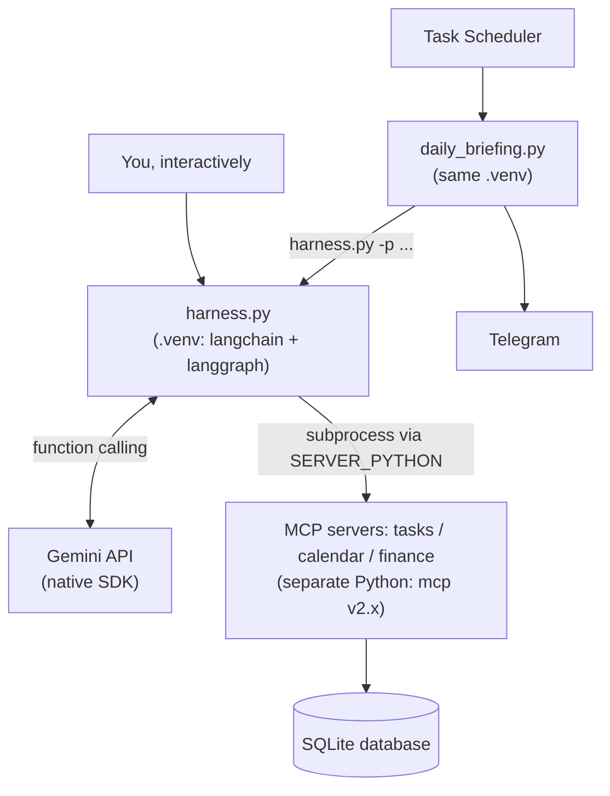

# Personal Life Admin Assistant — LangChain/LangGraph Edition

A third implementation of the same system, this time built on LangChain and LangGraph instead of [omp](https://github.com/JoseIgnacioD/personal-life-ai-assistant) or a [hand-built harness](https://github.com/JoseIgnacioD/personal-life-ai-assistant-custom-harness) — to see what a mainstream agent framework actually buys you, and what it costs.

## What this is

Same three MCP servers, same SQLite database, same daily Telegram briefing as both earlier versions. What changed is how the harness is built: `langchain-mcp-adapters` connects to the MCP servers and converts their tools automatically, and `langchain.agents.create_agent` provides the entire request → tool-call → execute → feed-back loop that the hand-built version wrote by hand.

The code is shorter. It also came with real problems the other two versions never had — documented below, because they turned out to be the more interesting part.

## Architecture



**Two separate Python environments are involved, on purpose.** `langchain-mcp-adapters` depends on the older MCP SDK (v1.x), which doesn't have the `MCPServer` class the three servers are built on. Rather than fight that, this project's own `.venv` runs the LangChain/LangGraph side with mcp v1.x, while the three servers keep running under a completely separate Python interpreter (referenced as `SERVER_PYTHON`) that has mcp v2.x. The two talk to each other fine over the actual MCP wire protocol — only the Python *packages* on either side are incompatible, not the protocol itself.

## Three real problems hit building this (and how they were fixed)

1. **A version conflict, not a code bug.** Installing `langchain-mcp-adapters` into the same environment as the servers silently downgrades `mcp` to v1.x and breaks them. Fixed with the two-environment split above — confirmed the wire protocol itself is compatible across the version boundary before committing to this design.
2. **An API deprecated mid-project.** `langgraph.prebuilt.create_react_agent`, used in every tutorial found while building this, is deprecated as of LangGraph 1.0 in favor of `langchain.agents.create_agent`. The working code uses the current one.
3. **A provider-specific field a generic adapter didn't know about.** Gemini's newer models attach an opaque `thought_signature` to function calls, which must be echoed back on the next turn or the API hard-fails with a 400. The generic OpenAI-compatible layer (`ChatOpenAI`) has no field for it; Google's own integration (`ChatGoogleGenerativeAI`) handles it correctly. This is a live, currently-open issue affecting other major tools too (OpenAI's own Codex CLI and Agents SDK included) — see [this LangChain forum thread](https://forum.langchain.com/t/does-langchain-openai-support-passing-gemini-3-s-thought-signatures-metadata-via-openrouter/2271) and [tracking issue #34328](https://github.com/langchain-ai/langchain/issues/34328).

A fourth issue showed up after switching to `ChatGoogleGenerativeAI`: its message content comes back as a list of content blocks (carrying the signature) rather than a plain string, and the first version of this harness sent that whole structure — signature included — straight to Telegram, which rejected it as oversized. `harness.py`'s `extract_text()` pulls out just the text; `tests/test_harness.py` regression-tests this directly.

## Requirements

- Two Python installations: one for this project's own `.venv` (LangChain/LangGraph), and your existing Python that already runs the three MCP servers (from the custom-harness project, with `mcp[cli]` installed)
- A Gemini API key
- A Telegram bot, for the daily briefing only

## Setup

1. **Find your existing "server" Python's path** — `where python`, before creating or activating this project's own venv.

2. **Create and activate this project's own venv**
   ```bash
   python -m venv .venv
   .venv\Scripts\Activate.ps1
   ```

3. **Install this project's dependencies**
   ```bash
   pip install -r requirements.txt
   ```

4. **Set your environment variables**
   ```bash
   setx SERVER_PYTHON "C:\path\to\your\other\python.exe"
   setx GEMINI_API_KEY "your-key-here"
   ```
   (open a fresh terminal afterward for these to take effect)

5. **Seed the database**
   ```bash
   python init_db.py
   ```

6. **Set up Telegram** (for the daily briefing only) — same as the other two projects: a bot via [@BotFather](https://t.me/BotFather), message it once, find your chat id via `https://api.telegram.org/bot<TOKEN>/getUpdates`, then set `TELEGRAM_BOT_TOKEN` and `TELEGRAM_CHAT_ID`.

7. **Schedule the daily briefing** — Task Scheduler running `python daily_briefing.py`, working directory set to this folder. Point the scheduled task at **this project's `.venv` Python**, not your system Python — `daily_briefing.py` uses `sys.executable` to launch `harness.py`, so whatever runs `daily_briefing.py` is what `harness.py` runs under too.

## Usage

```bash
python mcp_client.py          # milestone A: just list the tools, no model involved
python harness.py             # interactive chat, with memory across turns
python harness.py -p "..."    # one answer, then exit — what daily_briefing.py uses
python daily_briefing.py      # full run: ask the harness, send the result to Telegram
```

## Testing

```bash
python tests/test_harness.py
```

Covers `extract_text()` against the exact content shape that broke Telegram, and the full agent loop with real tool execution against the actual MCP servers — only the model's replies are simulated.

## Project structure

```
langchain-harness/
├── schema.sql              # database schema (shared, unchanged from the other two projects)
├── init_db.py               # creates + seeds personal_assistant.db
├── tasks_mcp.py              # MCP server: tasks (unchanged)
├── calendar_mcp.py           # MCP server: calendar (unchanged)
├── finance_mcp.py            # MCP server: finance (unchanged)
├── mcp_client.py              # milestone A: connects via langchain-mcp-adapters
├── harness.py                  # the LangChain/LangGraph agent + CLI
├── daily_briefing.py            # runs harness.py headlessly, sends to Telegram
├── requirements.txt
└── tests/
    └── test_harness.py
```

## What this practices

- **Evaluating a framework honestly** — less code to write, at the cost of a version conflict, a mid-project deprecation, and a provider-specific bug the framework's own abstraction hid rather than solved
- **MCP as a real protocol boundary**, again — the same three servers work completely unmodified, now with a third, structurally different client
- **The third piece of a matched set**: [omp-powered](https://github.com/JoseIgnacioD/personal-life-ai-assistant), [hand-built](https://github.com/JoseIgnacioD/personal-life-ai-assistant-custom-harness), and this one — the same system, three ways of building the harness underneath it
